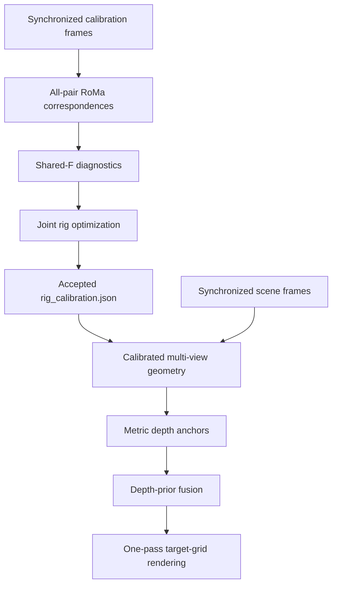

# Multi-camera alignment to an unknown-intrinsics target

Calibrate a fixed rig containing **two or more reference cameras with known
intrinsics** and **one target camera whose intrinsics are unknown**, then align
every reference image into the target pixel grid.

The target is not tied to a sensor type. It may be RGB, grayscale, thermal,
spectral, or another modality, provided the views contain enough shared scene
structure for correspondence matching.

The geometric method is unchanged from the original research workflow:

- RoMa v2 sparse correspondences over every unordered camera pair;
- per-frame and shared-fundamental-matrix diagnostics;
- joint fixed-rig pose and target-intrinsics optimization;
- calibrated multi-view triangulation in the target coordinate system;
- Depth Anything V2 relative-depth priors metrically anchored by triangulation;
- one-pass reference-to-target reprojection with Z-buffer and occlusion-aware
  bounded completion.

RoMa proposes correspondences only. Final images are never produced with a
free-form dense warp.

## Camera roles

| Role | Count | Intrinsics during optimization | Purpose |
|---|---:|---|---|
| Reference | 2 or more | Known; fixed by default | Constrain the rig, estimate scene depth, and provide aligned images |
| Target | Exactly 1 | Unknown; optimized from a supplied seed | Defines the output pixel grid |
| Anchor | One reference | Known | Defines the rig coordinate frame |
| Scale reference | A different reference | Known | Defines the translation gauge or measured baseline |

Camera names are user-defined. `reference_a`, `reference_b`, and `target` are
examples, not special identifiers.

## Quick start

```bash
python -m venv .venv
. .venv/bin/activate
python -m pip install --upgrade pip
python -m pip install -e .

# Create a two-reference project. Add more names after --references as needed.
multialign init ./my-project \
  --references camera_left camera_right \
  --target camera_target \
  --anchor camera_left \
  --scale-reference camera_right

multialign status ./my-project
multialign calibrate ./my-project
multialign align ./my-project
```

On Windows PowerShell, activate with `.\.venv\Scripts\Activate.ps1`; the
remaining commands are the same.

`multialign run ./my-project` runs calibration only when an accepted calibration
does not already exist, then starts alignment. Extra arguments after
`calibrate` or `align` are forwarded to the corresponding pipeline.

## Input contract

`multialign init` creates the complete project skeleton:

```text
PROJECT/
├── multialign.project.json
├── inputs/
│   ├── calibration/
│   │   ├── initial_calibration.json
│   │   └── images/
│   │       ├── camera_left/FRAME.*
│   │       ├── camera_right/FRAME.*
│   │       └── camera_target/FRAME.*
│   └── scenes/images/
│       ├── camera_left/FRAME.*
│       ├── camera_right/FRAME.*
│       └── camera_target/FRAME.*
├── models/depth_anything_v2_vits.pth
├── external/Depth-Anything-V2/
└── runs/
```

Within one capture, every camera file must have the same stem. Extensions and
camera resolutions may differ. A camera should keep one resolution within a
batch.

Replace the anonymous values in `initial_calibration.json` before calibration:

- every reference needs its real `image_size`, `K`, and `dist`;
- the target needs its real `image_size` and a reasonable `K`/`dist` seed;
- reference entries use `intrinsics_known: true` and the target uses
  `intrinsics_known: false`.

The template contains `example_only: true`. Readiness checks intentionally
reject it until real values replace the examples and that marker is removed or
set to `false`.

## Stage flow



The authoritative handoff between calibration and alignment is:

```text
runs/calibration/calibration/rig_calibration.json
```

The high-level CLI supplies this path automatically. See
[Pipeline details](docs/PIPELINE.md) and
[Project/output contract](docs/PROJECT_LAYOUT.md).

## Output contract

Outputs are separated by intended use:

```text
runs/alignment/
├── frames/FRAME/
│   ├── results/
│   │   ├── target_reference.png
│   │   ├── target_depth.png
│   │   ├── target_depth_confidence.png
│   │   ├── target_depth_strict_mask.png
│   │   ├── alignment_maps.npz
│   │   ├── CAMERA_aligned.png
│   │   ├── CAMERA_valid_mask.png
│   │   ├── CAMERA_overlay_50.jpg
│   │   ├── aligned_grid.png
│   │   ├── overlay_grid.png
│   │   └── overview.png
│   ├── diagnostics/
│   │   ├── depth_prior_report.json
│   │   ├── debug_depth_grid.png
│   │   ├── debug_render_grid.png
│   │   └── additional depth, occlusion, and fill diagnostics
│   └── frame_report.json
├── geometry/FRAME/
├── logs/
├── batch_summary.csv
├── batch_summary.json
└── index.html
```

`CAMERA_aligned.png` is the lossless aligned reference result.
`CAMERA_valid_mask.png` identifies sampleable support. The overview grids are
previews and automatically reflow for any number of reference cameras.
`alignment_maps.npz` is the machine-readable depth/map/mask payload.

Use strict masks and confidence for measurement. Visually complete renders may
contain only the bounded, explicitly reported completion used to improve display
coverage.

## Dependencies

- Python 3.10+
- NumPy, SciPy, and OpenCV (installed by this package)
- PyTorch and RoMa v2, installed for the local CUDA/CPU environment
- an official Depth Anything V2 source checkout and matching local checkpoint
- optional MobileSAM or Segment Anything source and checkpoint

This repository does not download model weights or embed access credentials.

## Quality and scale

- Calibration scenes should be static, depth-rich, and distributed across the
  common field of view. A single plane or low-parallax scene is insufficient.
- Alignment rejects `accepted_for_use: false` and forced calibration outputs
  unless a diagnostic override is explicitly supplied.
- Natural-scene epipolar geometry determines translation only up to scale. Pass
  `--scale-baseline-mm VALUE` to `multialign calibrate` when the anchor-to-scale
  reference baseline is measured in millimetres.
- Inspect held-out error, coverage, intrinsics drift, baseline ratios, and
  degeneracy diagnostics together; one RMS value is not enough.

## Data safety

The project-level ignore file excludes `inputs/`, `models/`, `external/`, and
`runs/`. The source repository also excludes common images, checkpoints,
arrays, logs, local configuration, and credentials. Only source, documentation,
and anonymous templates belong in version control.

## License

No open-source license is currently granted. Add one only after confirming the
intended terms and the licenses of RoMa v2, Depth Anything V2, PyTorch, OpenCV,
and any optional segmentation dependency.
