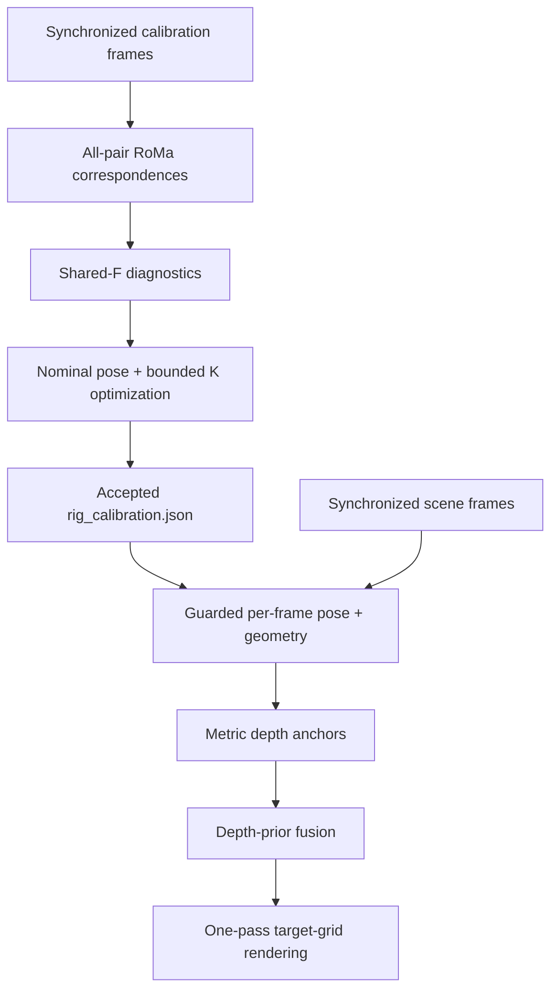

# Multi-camera alignment from rough or known calibration

Calibrate **two or more reference cameras** and **one target camera**, then
align every reference image into the target pixel grid. Intrinsics may be
measured, roughly seeded, or unknown. The nominal rig may be fixed or may have
small per-capture pose drift.

The target is not tied to a sensor type. It may be RGB, grayscale, thermal,
spectral, or another modality, provided the views contain enough shared scene
structure for correspondence matching.

The geometric method is:

- RoMa v2 sparse correspondences over every unordered camera pair;
- per-frame and shared-fundamental-matrix diagnostics;
- joint nominal-pose and bounded weak-intrinsics optimization;
- optional, guarded per-frame rotation/translation-direction refinement;
- calibrated multi-view triangulation in the target coordinate system;
- Depth Anything V2 relative-depth priors metrically anchored by triangulation;
- one-pass reference-to-target reprojection with Z-buffer visibility and an
  exact binary validity mask; occluded pixels are not filled by default.

RoMa proposes correspondences only. Final images are never produced with a
free-form dense warp.

## Camera roles

| Role | Count | Intrinsics during optimization | Purpose |
|---|---:|---|---|
| Reference | 2 or more | Fixed, tightly refined, or weakly self-calibrated | Constrain the rig, estimate scene depth, and provide aligned images |
| Target | Exactly 1 | Fixed or refined from a rough seed | Defines the output pixel grid |
| Anchor | One reference | Same policy as its reference group | Defines the rig coordinate frame |
| Scale reference | A different reference | Same policy as its reference group | Defines the translation gauge or measured baseline |

Camera names are user-defined. `reference_a`, `reference_b`, and `target` are
examples, not special identifiers.

## Quick start

```bash
python -m venv .venv
. .venv/bin/activate
python -m pip install --upgrade pip
python -m pip install -e .

# Create a two-reference project. Add more names after --references as needed.
multialign init ./my-project \
  --references camera_left camera_right \
  --target camera_target \
  --anchor camera_left \
  --scale-reference camera_right

multialign status ./my-project
multialign calibrate ./my-project
multialign align ./my-project
```

When every camera has only a rough intrinsic estimate and small pose drift is
possible, initialize the safer weak-calibration profile directly:

```bash
multialign init ./xiaomi-spectral \
  --references main wide tele supertele \
  --target spectral \
  --anchor main \
  --scale-reference wide \
  --all-intrinsics-unknown \
  --allow-pose-drift
```

See [`examples/xiaomi15u_spectral.initial_calibration.json`](examples/xiaomi15u_spectral.initial_calibration.json)
for 35 mm-equivalent focal seeds. They are priors, not factory calibration.

On Windows PowerShell, activate with `.\.venv\Scripts\Activate.ps1`; the
remaining commands are the same.

`multialign run ./my-project` runs calibration only when an accepted calibration
does not already exist, then starts alignment. Extra arguments after
`calibrate` or `align` are forwarded to the corresponding pipeline.

## Input contract

`multialign init` creates the complete project skeleton:

```text
PROJECT/
├── multialign.project.json
├── inputs/
│   ├── calibration/
│   │   ├── initial_calibration.json
│   │   └── images/
│   │       ├── camera_left/FRAME.*
│   │       ├── camera_right/FRAME.*
│   │       └── camera_target/FRAME.*
│   └── scenes/images/
│       ├── camera_left/FRAME.*
│       ├── camera_right/FRAME.*
│       └── camera_target/FRAME.*
├── models/depth_anything_v2_vits.pth
├── external/Depth-Anything-V2/
└── runs/
```

Within one capture, every camera file must have the same stem. Extensions and
camera resolutions may differ. A camera should keep one resolution within a
batch.

Replace the anonymous values in `initial_calibration.json` before calibration.
There are two supported forms:

- Measured intrinsics: provide numeric `image_size`, `K`, and `dist`, and set
  `intrinsics_known: true` when those values should be trusted.
- Rough intrinsics: use `"image_size": "auto"`, `"K": "auto"`, and set
  either `focal_length_35mm` or `focal_ratio`. Image dimensions come from the
  match data, the principal point defaults to image centre, and
  `intrinsics_known` should be `false`.

For example:

```json
{
  "intrinsics_known": false,
  "image_size": "auto",
  "K": "auto",
  "focal_length_35mm": 23.0,
  "principal_point_fraction": [0.5, 0.5],
  "dist": [0, 0, 0, 0, 0]
}
```

If neither focal field is supplied, `focal_ratio: 1.0` (one focal pixel per
pixel of the larger image dimension) is used as a deliberately weak seed.

The template contains `example_only: true`. Readiness checks intentionally
reject it until real values replace the examples and that marker is removed or
set to `false`.

## Stage flow



The authoritative handoff between calibration and alignment is:

```text
runs/calibration/calibration/rig_calibration.json
```

The high-level CLI supplies this path automatically. See
[Pipeline details](docs/PIPELINE.md) and
[Project/output contract](docs/PROJECT_LAYOUT.md).

## Weak intrinsics and small pose drift

`calibration.reference_intrinsics: "weak"` jointly refines each reference
focal scale and principal point around its seed. The target uses
`target_model: "focal-pp"`. Broad bounds are paired with priors, held-out
error checks, parameter-bound checks, and a Jacobian condition-number gate.
An accepted result is still self-calibration, not a replacement for an
independent calibration target or validation set. In particular, a common
focal-scale bias can remain prior-sensitive even when epipolar residuals are
small.

`alignment.pose_refinement: "essential"` estimates a per-frame relative pose
for each target/reference pair. It changes only rotation and translation
direction; the global calibrated baseline magnitude is retained because
essential geometry cannot recover scale. An update is accepted only when it
has enough spatially balanced inliers, is not homography-dominated, stays
within the configured drift limits, and improves epipolar residuals. Otherwise
that camera falls back to the nominal calibration for the frame. The accepted
pose is carried into depth anchoring, Z-buffering, and final rendering.

`alignment.render_mode: "strict"` is the default and the recommended setting
for measurement. It disables occlusion propagation, display-crack filling, and
texture inpainting. The lossless aligned PNG is zero outside the accompanying
binary validity mask. The former bounded display completion remains available
only through the explicit `"complete"` mode.

Existing geometry caches are invalidated automatically when the requested pose
refinement mode changes. Existing completed frame outputs still require
`multialign align PROJECT --overwrite --rerun-geometry` to be regenerated.

## Relation to the referenced methods

- [RGB-MS](https://cvlab-unibo.github.io/rgb-ms-web/) motivates treating
  cross-sensor registration as stereo correspondence/disparity rather than a
  single global homography. Its learned model is not embedded here because it
  requires its own training setup and paired data.
- [Plant3DImageReg](https://github.com/eric-stumpe/Plant3DImageReg) motivates
  calibrated 3D reprojection, ray casting, and explicit occlusion handling.
  This project keeps those geometric principles but does not require its fixed
  calibrated camera/depth-sensor rig.

## Output contract

Outputs are separated by intended use:

```text
runs/alignment/
├── frames/FRAME/
│   ├── results/
│   │   ├── target_reference.png
│   │   ├── target_depth.png
│   │   ├── target_depth_confidence.png
│   │   ├── target_depth_strict_mask.png
│   │   ├── alignment_maps.npz
│   │   ├── CAMERA_aligned.png
│   │   ├── CAMERA_valid_mask.png
│   │   ├── CAMERA_overlay_50.jpg
│   │   ├── aligned_grid.png
│   │   ├── overlay_grid.png
│   │   └── overview.png
│   ├── diagnostics/
│   │   ├── depth_prior_report.json
│   │   ├── debug_depth_grid.png
│   │   ├── debug_render_grid.png
│   │   └── additional depth and visibility diagnostics
│   └── frame_report.json
├── geometry/FRAME/
├── logs/
├── batch_summary.csv
├── batch_summary.json
└── index.html
```

`CAMERA_aligned.png` is the lossless, unfilled aligned reference result in the
default strict mode. `CAMERA_valid_mask.png` is its exact uint8 binary mask
(255 = valid Z-buffer-visible sample, 0 = occluded/out-of-field/unsupported),
and pixels outside it are zero in the PNG. The overview grids are previews and
automatically reflow for any number of reference cameras. `alignment_maps.npz`
contains the same mask as `CAMERA_valid_mask` plus numeric depth and mapping
arrays.

## Dependencies

- Python 3.10+
- NumPy, SciPy, and OpenCV (installed by this package)
- PyTorch and RoMa v2, installed for the local CUDA/CPU environment
- an official Depth Anything V2 source checkout and matching local checkpoint
- optional MobileSAM or Segment Anything source and checkpoint

This repository does not download model weights or embed access credentials.

## Quality and scale

- Calibration scenes should be static, depth-rich, and distributed across the
  common field of view. A single plane or low-parallax scene is insufficient.
- With all intrinsics unknown, capture tilted targets and natural structure at
  several depths and across the image corners. Frontal planar boards alone do
  not constrain focal length, principal point, pose, and distortion reliably.
- Alignment rejects `accepted_for_use: false` and forced calibration outputs
  unless a diagnostic override is explicitly supplied.
- Natural-scene epipolar geometry determines translation only up to scale. Pass
  `--scale-baseline-mm VALUE` to `multialign calibrate` when the anchor-to-scale
  reference baseline is measured in millimetres.
- Inspect held-out error, coverage, intrinsics drift, baseline ratios, and
  degeneracy diagnostics together; one RMS value is not enough.
- Per-frame pose refinement handles only small motion. It does not estimate a
  changing focal length, autofocus breathing, rolling shutter, or large rig
  reconfiguration. Pixel-level accuracy must be measured on held-out captures.

## License

The source code in this repository is available under the MIT License. RoMa v2,
Depth Anything V2, PyTorch, OpenCV, and any optional segmentation dependency
remain subject to their own licenses and model terms.
